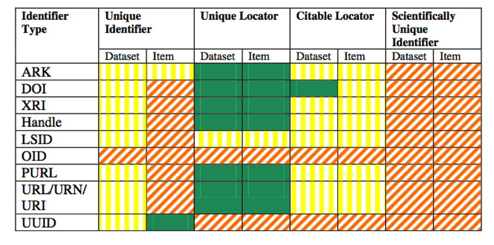

#Identifiers

##What is an identifier?
An identifier, most simply, is “a name that identifies either a unique object or a unique class of objects.”  In computer or technical systems, these are often found in the form of bar codes, QR codes or unique alphanumeric strings such as ISSNs or URLs.  

In data curation, we need identifiers to battle reference rot: if data are playing the role of evidence in research and public policy, they need to be accessible for the long-term.  Using stable identifiers is key to this: they allow users to reliably reference and locate materials.

##IDs for data curation

Identifiers for data curation must be:

- Machine Readable: they must be consistently formatted in a way that computers can parse them
- Unique: at least within a local system, but preferably globally
- Persistent: they must be long-lasting
- Resolvable: they must work with resolution services to point users to a resource.

There are many different kinds of identifier schemas for use with data:

- Archival Resource Keys (ARKs)
- Digital Object Identifiers (DOIs)
- Extensible Resource Identifiers (XRIs)
- Handle System (Handles or HDLs)
- Life Science Unique Identifiers (LSIDs)
- Object Identifiers (OIDs)
- Persistent Uniform Resource Locators (PURLs)
- Uniform Resource Identifiers/Names/Locators (URIs/ URNs/URLs)
- Universally Unique Identifiers (UUIDs)

All of these have different properties:

**[Reference?]**

##DOIs

Digital Object Identifiers, or DOIs, have recently gained widespread use with both bibliographic materials and datasets, largely thanks to their adoption and subsequent popularization by CrossRef.

DOIs are character strings, and can be divided into three parts: the URL of resolution service (e.g. the metadata store that redirects the user to the current location of the digital object), a prefix which points to the identity of the registrant (e.g. the company or individual assigning the DOI), and a suffix which points to the object itself.  The prefix and suffix are separated by a forward slash:

Once created, a DOI cannot be renamed or deleted.

There are a number of services that can "mint" or assign DOIs for datasets, including:

- EZID: Run out of the California Digital Library.  Major benefits include links with CrossRef and additional metadata and citation formatting services

- DataCite: stores metadata in their in-house datastore, which provides some advantages over CrossRef (stability, and better search?)

Both service require institution- or project-level paid subscriptions.

The prevalence of DOI minting services means that while each identifier is unique and only points to one resource, there's nothing keeping different DOI services from minting multiple identifiers for one resource.  

##DOIs alone are not enough
Just as an address won’t prevent a house from being demolished or remodeled, an ID will not prevent “content drift,” or prevent data from being deleted from its hosting server.  Furthermore, its important to remember that a DOI doesn't:

- make data more or less citable (remember, we've been citing papers and books long before they had DOIs attached to them!)
- make data more or less trustworthy (DOIs can be assigned to anything, even nonscholarly, non-peer-reviewed objects).
- make data more or less stable as a data set.  Though DOIs cannot be altered or destroyed, digital objects still can be.  **Just because a paper or object has a DOI assigned to it doesn't mean that it can't/won't be changed or altered by its host.**

##Bibliography

- Duerr, R. E., Downs, R. R., Tilmes, C., Barkstrom, B., Lenhardt, W. C., Glassy, J. J., … Slaughter, P. (2011). On the Utility of identification schemes for digital earth science data: an assessment and recommendations. Earth Science Informatics, (4), 139–160. doi:10.1007/s12145-011-0083-6

- Klein, M., Van de Sompel, H., Sanderson, R., Shankar, H., Balakireva, L., Zhou, K., & Tobin, R. (2014). Scholarly Context Not Found: One in Five Articles Suffers from Reference Rot. PLoS ONE, 1–39. doi:10.1371/journal.pone.0115253

- Starr, J., & Gastl, A. (2011). isCitedBy: A Metadata Scheme for DataCite. D-Lib Magazine, 17(12).

- Van de Sompel, H., Sanderson, R., Shankar, H., & Klein, M. (2014). Persistent Identifiers for Scholarly Assets and the Web: The Need for an Unambiguous Mapping. International Journal of Digital Curation, 9(1), 331-342.

- http://www.doi.org/doi_handbook/2_Numbering.html

Blog posts from RDM Page 

- Page, RDM. (2013) Multiple DOIs for one article issued by different publishers.  iPhylo.  http://iphylo.blogspot.com/2013/05/duplicate-dois-for-same-article-issued.html

- On identifiers (again) http://iphylo.blogspot.com/search?updated-max=2014-12-17T18:31:00Z

- DOIs are not enough http://iphylo.blogspot.com/2014/05/dois-are-not-enough.html

- http://crosstech.crossref.org/2013/09/dois-unambiguously-and-persistently-identify-published-trustworthy-citable-online-scholarly-literature-right.html

- http://ezid.cdlib.org/home/why