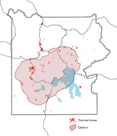
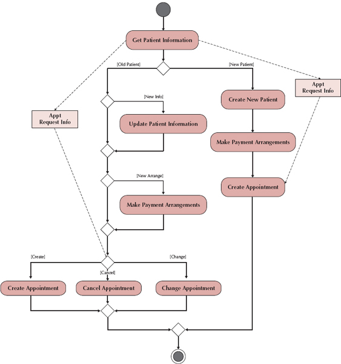
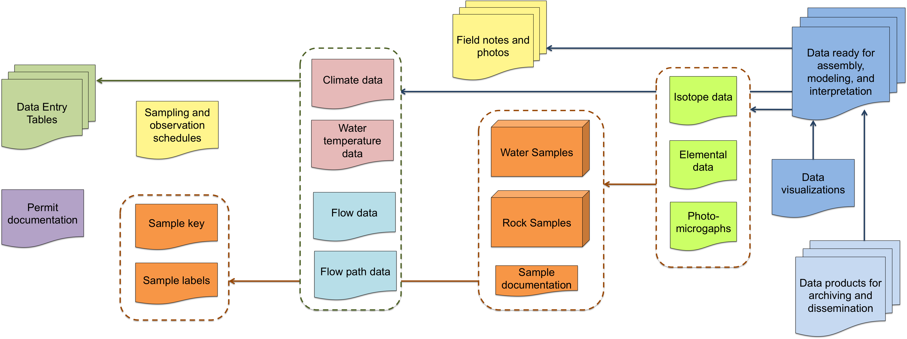
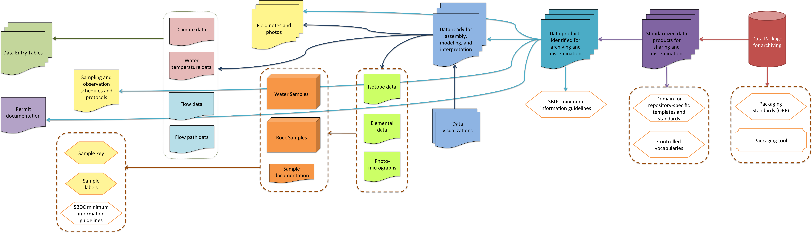

#The Site-Based Data Curation Project

##Overview

The Site-Based Data Curation (SBDC) project at the University of Illinois has been developing a framework of policies and best practices for the curation of digital research data collected _in the field from scientifically significant sites_, using the interdisciplinary field of geobiology as an initial case study. 

The SBDC framework will help researchers produce shareable, reusable data by:

1) capturing the context of data collection needed for reuse by researchers in multiple disciplines,
2) streamlining submission of reusable data to open repositories, and
3) organizing collections for access within and across field sites.

**About Geobiology**

Our initial case study has focused on the interdisciplinary field of geobiology, as conducted in the geothermal hot springs at Yellowstone National Park (YNP).  Geobiologists study the interactions between microbial organisms and the sediments they live in and generate.  The microbes living in the hot springs at YNP are particularly interesting for being _thermophiles_: they can only live in extremely hot temperatures.  Thus, YNP has become an important research locality for scientists interested in understanding how life on earth may have originally evolved (many think that it may have emerged from similar, ancient hot springs or undersea volcanic vents), or even how life may evolve on other planets.  Furthemore, there are quite a number of industrial applications to this work: _Taq polymerase_, an enzyme critical to DNA amplification, was first found and isolated from a bacterium living in the hot springs at YNP.

**About Yellowstone National Park**

YNP was established as the USA's first national park in 1872, and is world famous for its numerous hot springs and geysers: the park includes more than 10,000 hydrothermal features, including more than 300 geysers.  The majority of the park is located within the eroded caldera of a (still active!) ancient volcano, which last erupted 174,000 years ago.  The site is still quite geologically active, and thus of enormous interest to a broad range of scientists:

>The park's geothermal system is the visible expression of the immense Yellowstone volcano; they would not exist without the underlying magma body that releases tremendous heat. They also depend on sources of water, such as the mountains surrounding the Yellowstone Plateau. There, snow and rain slowly percolate through layers of permeable rock riddled with cracks. Some of this cold water meets hot brine directly heated by the shallow magma body. The water's temperature rises well above the boiling point but the water remains in a liquid state due to the great pressure and weight of the overlying water. The result is superheated water with temperatures exceeding 400°F. (["Hydrothermal Systems"](http://www.nps.gov/yell/naturescience/hydrothermalsystems.htm))

_Geothermal areas (red) and caldera (shaded) in Yellowstone National Park.
(courtesy NPS)_

##Minimum information guidelines:

Capturing context in the field is crucial for research on geothermal systems: all sampling locations need to be contextualized by their location relative to the feature vent, and by the water chemistry of the spring at the sampling point. These data points concretely situate sampling locations within a geothermal system, and can act as community recognized “anchor points” that help future researchers integrate diverse datasets.

In Spring 2013, we held a stakeholders' workshop to begin generating more specific metadata requirements for geobiology data. Working with geobiologists and resource managers, we developed the following minimum information guidelines for different aspects of geobiology work at YNP:

**MINIMUM INFORMATION ABOUT A FIELD TRIP**

1. Full name(s) of PI/Investigators, all members of the field party
2. Permit number
3. Date and time range of campaign
4. Thermal Feature Name(s): list of locations sampling was conducted. For sites at YNP, we recommend that researchers use names from the NPS Thermal Inventory location name and ID number (corrected as needed)
5. Investigator Sample ID numbering scheme – a short description of your basic sample reference code structure
6. A free text description of the purpose of the field trip and the sampling plan specifics

**MINIMUM INFORMATION ABOUT A GEOTHERMAL VENT**

1. GPS location at vent- up to 3X different types of input coordinates
2. Altitude (Elevation) at vent – in meters derived from topographical maps or separate GPS systems
3. Vent Water Temperature – with brief description of techniques, stats of data collection
4. Vent Water pH – with brief description of techniques, stats of data collection
5. A contextualizing field photograph that includes the vent of the thermal feature and its surrounding environment (i.e. single facies at mm-cm-m+ length-scale and specific position within the drainage system) with embedded digital information on sample sites and other information (not just a “marked” photo)
6. A short free text description of the site overall, including the condition of the vent and sampling sites

**MINIMUM INFORMATION ABOUT A SAMPLING SITE**

For each sampling site, we recommend that researchers record:

1. Sample ID number
2. Sampling position relative to the vent – distance from vent and bearing to/from vent, and name of facies
3. Field photograph of the sampling site – shot at a length-scale that includes the specific sample within the thermal feature and its surrounding environment
4. Water temperature (for water samples)
5. pH (for water samples)

##Process modeling for data curation: Workflow documentation as a curatorial tool

After developing the minimum information guidelines, we sought to "test" their efficacy by curating a dataset (a year's worth of field data collected by our co-PI Bruce Fouke) according to their recommendations.  However, this presented us with a problem: while the guidelines tell what kind of data to collect, they don't tell us how or when to collect it.  Furthermore, no metadata schema is capable of reconstructing metadata that was never collected in the first place!

We turned to a method from systems analysis for help: process modeling and activity diagramming.

**PROCESS MODELING & ACTIVITY DIAGRAM**

Process models, 

>describe the different activities that, when combined, support a [research] process. [Research] processes typically cut across functional departments (e.g., the creation of a new [dataset] involves many different activities that combine the efforts of many [researchers]). (edited from Dennis et al, ch 4, 2012)

Process modeling is often visualized in the form of an activity diagram.  Activity diagrams, "portray the primary activities and the relationships among the activities in a process" (ibid).  They model activities, objects and decisions as workflows:

_From Dennis et al, 2012, ch 4.  We will talk more about this method in detail during today's lab_

Process models are typically created through discussions with a systems designer or potential users _before_ a system is developed.  Because our model was retrospective, we took the following steps:

1. Assessed and inventoried Bruce's field data from one year (including digital data such as spreadsheets, databases, gene sequences, field notes, field photographs and more)
2. Began trying to relate "final" products with their "raw" parents
3. Created a first draft of an activity diagram
4. Consulted with Bruce to see how accurate it was, and corrected as necessary
5. Repeated steps 1-4 as necessary.

Two diagrams resulted:

_Bruce's field data, as linked from parent to child_

_ver. 1 of the activity model_

After this first iteration, we went on to curate Bruce's data for submission to a repository.  We then revised both diagrams again to account for our curatorial work, and to begin identifying "points of intervention" at which Bruce could begin curatorial work earlier during future field trips.

_Version 2 of the activity model and data diagram. The panels below represent different stages of research and curatorial work; each colored box corresponds to similarly colored documents and data products above. Each data product or sample is linked to its parent data products by arrows. Each element with < pointed corners > represents a standard, protocol or best practice. Each box below with a red border represents a curatorial point of intervention identified through our work._

The final workflow has 6 stages: Planning, Fieldwork, Processing & Analysis, Data Assessment, Standardizing and Packaging. 

Though this diagram is specific to the field of geobiology -- and indeed, Dr. Fouke's particular field practices -- we are working with other researchers in other fields to document their research and curation workflows as well, and we hope that the resulting workflows can be altered and used by others.  

##Works Cited

The SBDC Guide [link](https://sitebaseddatacuration.wordpress.com/)

More on YNP [link](http://www.nps.gov/yell/index.htm)

Dennis, Alan., Wixom, Barbara Haley,Tegarden, David Paul. (2012) Systems analysis design UML version 2.0an object oriented approach Hoboken, NJ : J. Wiley & Sons,

## Acknowledgements
The SBDC project is a collaboration among information scientists, data archiving experts, geobiologists, and site resource managers at the University of Illinois at Urbana-Champaign, the University of Washington, Johns Hopkins University, and Yellowstone National Park. This presentation summarizes work conducted by the SBDC Team since 2012. Team members include: Carole Palmer (PI), Bruce Fouke, G. Sayeed Choudhury, Ann Rodman, Karen Baker, Jacob Jett, Abigail Asangba, Karen Wickett, Sean Gordon, and Christie Hendrix.  Dr. Wickett in particular has been instrumental in developing the process modeling approach described here.

The SBDC Project has been funded through Institute of Museum and Library Service National Leadership Grant number LG-06-12-0706-12.
